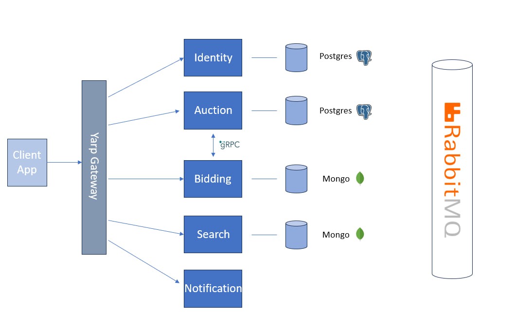

# FleetBid
FleetBid is a web application for car auctions, where users can register, list their vehicles for sale, place bids on other cars, and use filters to search by color, year of manufacture, and model.

## Content
- [Architecture](#Architecture)
- [Technologies](#Technologies)
- [Testing](#Testing)
- [Deployment](#Deployment)
- [Why was the project created?](#Why-was-the-project-created?)

## Architecture
The project is based on a microservice architecture, with multiple services managing different aspects of the application.

### Services
- [AuctionService](src/AuctionService)
- [BiddingService](src/BiddingService)
- [GatewayService](src/GatewayService)
- [IdentityService](src/IdentityService)
- [NotificationService](src/NotificationService)
- [SearchService](src/SearchService)

## Technologies
### Backend
- [C#.NET8](https://learn.microsoft.com/en-us/dotnet/core/whats-new/dotnet-8/overview): Main language for backend development.
- [gRPC](https://grpc.io/) and REST API: Used for data exchange between microservices.
- [RabbitMQ](https://www.rabbitmq.com/): Message queueing system for processing messages between services.
- [Entity Framework Core](https://learn.microsoft.com/en-us/ef/core/): ORM for database management.
- [PostgreSQL](https://www.postgresql.org/) and [MongoDB](https://www.mongodb.com/): Main databases.
- [AutoMapper](https://automapper.org/): Automatically maps objects.
- [JWT](https://jwt.io/): Used for authentication and authorization.
- [YARP Gateway](https://microsoft.github.io/reverse-proxy/): Proxy server for request routing.
- [Serilog](https://serilog.net/): Logging.
- [Docker](https://www.docker.com/): Application containerization.
- [SignalR](https://learn.microsoft.com/en-us/aspnet/signalr/overview/getting-started/introduction-to-signalr): WebSockets for real-time functionality.

  ### Frontend
- [React](https://react.dev/) and [Next.js](https://nextjs.org/): Frameworks used for building the user interface.
- [Tailwind](https://tailwindcss.com/): CSS library for styling.

## Testing
Unit tests and integration tests have been conducted to verify the functionality and ensure proper interaction between all system components.

## Deployment
Docker and containers are used for building and deployment, allowing the application to be easily transferred and scaled in the cloud or locally.

### Why was the project created?
This project was created with the goal of learning new technologies and gaining a deeper understanding of microservice architecture. Additionally, it provided hands-on experience with modern tools and frameworks such as gRPC, RabbitMQ, Docker

